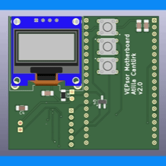

# VEPsor – Motherboard Hardware

The **VEPsor Motherboard** is the central hardware component of the VEP Analyzer project. It functions as the primary interface between VEP sensor modules, processing units, and external systems, enabling reliable data acquisition and seamless system integration.

This repository contains all resources required to review, manufacture, and assemble the motherboard.

---

## Preview

---

## Repository Contents

- **KiCad Project Files**  
  Complete schematic and PCB layout files for modification and extension.

- **Bill of Materials (BOM)**  
  Comprehensive list of components required for assembly.

- **Gerber Files**  
  Manufacturing-ready files for PCB fabrication.

- **schematics.pdf**  
  Exported schematic for quick inspection of the circuit design.

---

## Overview

The motherboard is designed to:

- Interface with VEP sensor modules  
- Provide stable power distribution across the system  
- Enable communication between hardware components  
- Serve as a reliable platform for BCI system integration  

### Key Design Goals

- Modular integration with sensor units  
- Robust signal routing and power management  
- Use of standard, widely available components  
- Expandability for future system extensions  

---

## Getting Started

### 1. Review the Design
- Open the KiCad project files for full access to the design  
- Use `schematics.pdf` for a quick overview  

### 2. PCB Fabrication
- Upload the Gerber files to a PCB manufacturer (e.g., JLCPCB, PCBWay)

### 3. Component Sourcing
- Use the BOM to procure all required components  

### 4. Assembly
- Assemble the board according to the PCB layout and schematic  
- Verify all power rails and connections before powering the system  

---

## Notes

- Ensure proper handling of power distribution sections  
- Follow ESD safety procedures during assembly  
- Validate voltage levels before connecting sensor modules  

---

## Intended Use

This hardware is intended for:

- Research and development in BCI systems  
- Integration of VEP-based sensing platforms  
- Experimental signal acquisition and processing setups  

This system is **not intended for medical or clinical use**.

---

## Feedback and Contributions

Feedback is encouraged. If you identify a bug, design issue, documentation error, or have suggestions for improvement, please open an Issue.

Constructive comments and contributions are welcome.