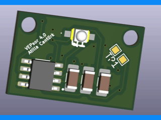

# VEPsor – VEP Sensor Hardware

**VEPsor (VEP Sensor)** is the hardware acquisition component of the VEP Analyzer project. It provides a compact and reproducible platform for capturing visual evoked potentials (VEPs) in Brain-Computer Interface (BCI) applications.

This repository contains all resources required to review, manufacture, and assemble the hardware.

---

## Preview

---

## Repository Contents

- **KiCad Project Files**  
  Complete schematic and PCB design files for editing and modification.

- **Bill of Materials (BOM)**  
  Comprehensive list of components required for assembly.

- **Gerber Files**  
  Manufacturing-ready files for PCB fabrication.

- **schematics.pdf**  
  Exported schematic for quick inspection and validation of the circuit design.

---

## Overview

The VEPsor board is designed for:

- Acquisition of EEG signals related to visual stimuli  
- Integration into BCI systems  
- Rapid prototyping and experimental validation  

### Key Design Goals

- Reproducibility  
- Use of accessible, standard components  
- Compatibility with common EEG acquisition workflows  

---

## Getting Started

### 1. Review the Design
- Open the KiCad project files for full access to schematics and layout  
- Alternatively, inspect `schematics.pdf` for a quick overview  

### 2. PCB Fabrication
- Upload the Gerber files to a PCB manufacturer (e.g., JLCPCB, PCBWay)

### 3. Component Sourcing
- Use the BOM to order all required components  

### 4. Assembly
- Assemble the PCB according to the schematic and layout  
- Verify all connections before powering the board  

---

## Notes

- Handle analog and sensitive components with care  
- Follow ESD protection practices during assembly  
- Verify power supply requirements before operation  

---

## Intended Use

This hardware is intended for:

- Research and educational purposes  
- Experimental BCI systems  
- VEP signal acquisition and analysis  

This system is **not intended for medical or clinical use**.